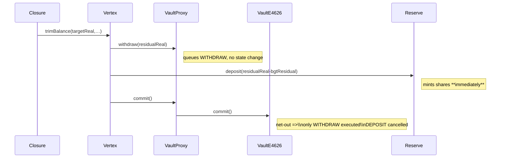

Early Cider Sardine

High

# Burve's Vault Netting Allows Minting Unbacked Reserve Shares, Diluting LPs and Draining Real Assets

## Brief

The Vertex → Reserve accounting pipeline mints reserve-shares without ever delivering the underlying tokens.

Every call to [VertexImpl.trimBalance()](https://github.com/sherlock-audit/2025-04-burve/blob/main/Burve/src/multi/vertex/Vertex.sol#L60) records a withdrawal from the vault, but—before that withdrawal is actually executed—immediately “re-deposits” part of the same amount through `ReserveLib.deposit()`.

Because deposits and withdrawals are netted inside `VaultE4626.commit()`, the deposit leg is silently cancelled while the reserve-shares it already issued remain outstanding.

Over time this phantom-mint pathway inflates the reserve-share supply, dilutes or even voids the value of honest users’ shares and lets an attacker siphon future real deposits/BGT rewards without providing any assets.

## Details

### 1. Call-sequence that creates un-collateralised shares



### 2. Critical code paths

### (1) `VertexImpl.trimBalance`

```solidity
uint256 residualReal = realBalance - targetReal;
vProxy.withdraw(cid, residualReal);                 // [1] queues withdraw
reserveSharesEarned = ReserveLib.deposit(           // [2] mints shares NOW
        vProxy, self.vid, residualReal - bgtResidual);
vProxy.commit();                                    // [3] executes vault ops

```

### (2) `ReserveLib.deposit`

```solidity
balance = vProxy.balance(RESERVEID, true);          // reads old balance
vProxy.deposit(RESERVEID, amount);                  // queues deposit only
shares = (balance==0)                               // share calc **before** deposit
        ? amount * SHARE_RESOLUTION                 // first-mover bonus
        : amount * reserve.shares[idx] / balance;
reserve.shares[idx] += shares;                      // <-– **phantom shares**

```

### (3) `VaultE4626.commit` (netting logic)

```solidity
if (assetsToDeposit > 0 && assetsToWithdraw > 0) {
    // deposits and withdrawals are offset
    assetsToDeposit -= min(...);
    assetsToWithdraw -= min(...);
}
if (assetsToDeposit > 0) { vault.deposit(...); }
else if (assetsToWithdraw > 0) { vault.withdraw(...); }

```

Because `assetsToWithdraw` (residualReal) is strictly **larger** than the queued
`assetsToDeposit` (`residualReal - bgtResidual`), netting zeroes the deposit,
so no tokens ever reach the reserve yet the shares stay minted.

### 3. Why this is exploitable

- **No post-commit reconciliation** – `ReserveLib` never checks whether its queued deposit really happened.
- **Executed on every pool interaction** – `trimBalance()` runs during swaps, (un)staking, value adds/removes, so inflation is continuous.
- **First-depositor multiplier** – when `reserve.shares[idx]==0`, the attacker receives `amount × 100` shares, magnifying the gap.

### 4. Minimal numeric example


Step | Real tokens in vault | Reserve shares supply | Comment
-- | -- | -- | --
A. start | 1 000 | 0 | –
B. trimBalance sees 200 excess | queues withdraw 200 & deposit 100 | mints 100×100 = 10 000 shares | still 1 000 tokens
commit net-outs | vault sends 200 to contract, deposit leg cancelled | 10 000 shares backed by 0 tokens | 200 loose tokens free for BGT residual
Next user deposits 1 000 tokens to reserve | supply ↑ to 20 000 shares | phantom holder owns 50 % of real 1 000 tokens |  

The attacker created half the reserve with **zero cost**.

## Impact

Un-collateralised reserve-shares are minted on every balance-trim, letting an attacker continuously dilute honest LPs, capture a disproportionate share of future reserve withdrawals and BGT emissions, and ultimately drain real assets from the protocol while providing none. Left unfixed, the reserve can become insolvent and users will withdraw fewer tokens than accounted, resulting in direct financial loss and systemic loss of trust in Burve Finance.